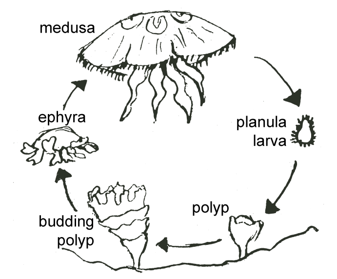
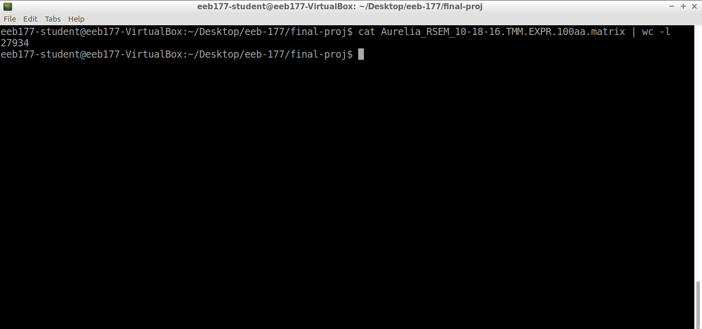

# Aurelia
```{r, out.width= "400px", echo=FALSE}

```


---

## Exploring the Aurelia Transcriptome
```{r, out.height = "400px", echo=FALSE}


```

Over 20K genes

Wow! That's a lot of genes!

---

# Taking the means of biological replicates

- Demonstrate replicate_averager script
- More than one data entry for each life stage

---

# Let's visualize some data!

### Cluster 3 genes
```{r}
cluster3 <- read.csv("../mean_cluster3_counts.csv", sep = "\t", as.is = T)

# Format row names
rownames(cluster3) <- cluster3$X
colnames(cluster3)
cluster3 <- cluster3[, -1]
```

---

```{r}
# Make heatmap
library(gplots)
cluster3_centr <- cluster3 / rowMeans(cluster3)
heatmap.2(as.matrix(cluster3_centr), Colv = NA, labRow = "", main = "Cluster 3 genes heat map", labCol = c("E.Plan", "L.Plan", "Polyp", "E.Strob", "L.Strob", "Ephyra", "Juvenile"), trace = "none", dendrogram = "row")
```

---

# Another way to visualize this data
```{r}
cluster3 <- read.csv("../mean_cluster3_counts.csv", sep = "\t")

# Format row names
names(cluster3) <- c("Gene", "E. Planula", "L. Planula", "Polyp",
                     "E. Strobila", "L. Strobila", "Ephyra", "Juvenile")

# reshape dataframe to "long" version
library(reshape2)
df <- melt(cluster3, id = c("Gene"), variable.name = "Stages")

library(ggplot2)
p1 <- ggplot(df, aes(x = Stages, y = log2(value), by = Gene)) +
  geom_line(aes(group = Gene, color = Gene), alpha = 0.2) +
  geom_point(alpha = 0.2, aes(color = Gene, group = Gene), size = 0.5) +
  theme(legend.position = "none") +
  ggtitle("Cluster 3 Genes across stages")

# "Eye development" genes
eye <- read.csv("../mean_eye_counts.csv", sep = "\t")
names(eye) <- c("Gene", "E. Planula", "L. Planula", "Polyp",
                     "E. Strobila", "L. Strobila", "Ephyra", "Juvenile")

df2 <- melt(eye, id = c("Gene"), variable.name = "Stages")
p2 <- ggplot(df2, aes(x = Stages, y = log2(value), by = Gene)) +
  geom_line(aes(group = Gene, color = Gene)) +
  geom_point(alpha = 0.2, aes(color = Gene, group = Gene), size = 0.5) +
  theme(legend.position = "bottom") +
  ggtitle("Eye Development Genes across stages")

# plot both graphs together
library(gridExtra)
grid.arrange(p1, p2, nrow = 2)

```

---

